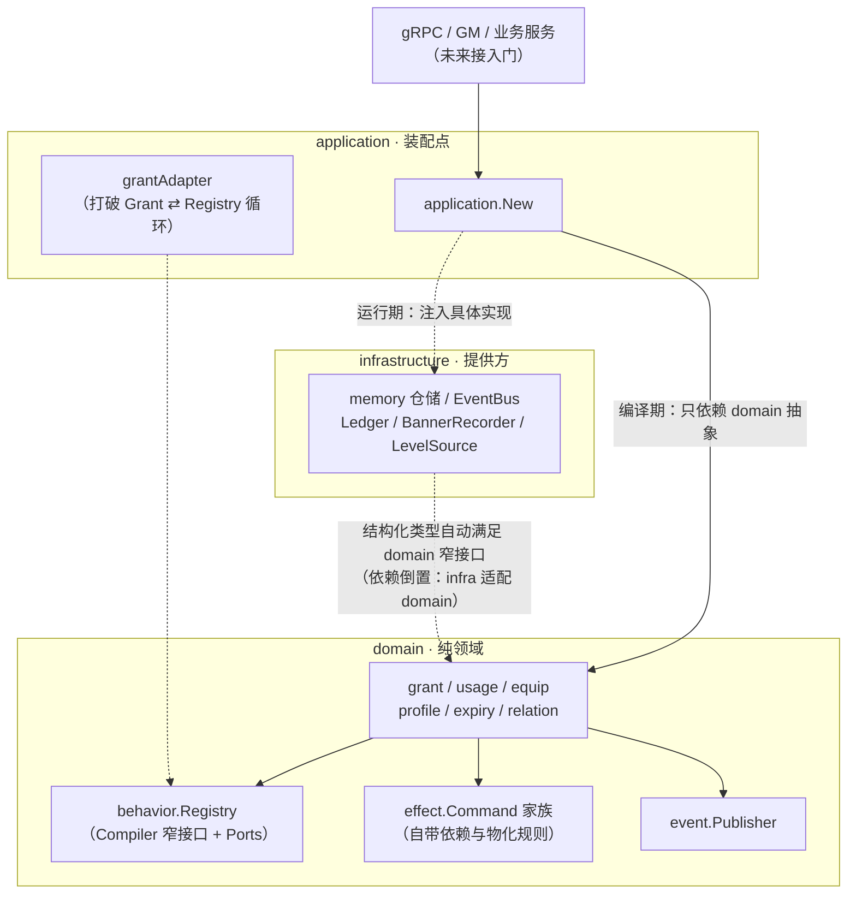
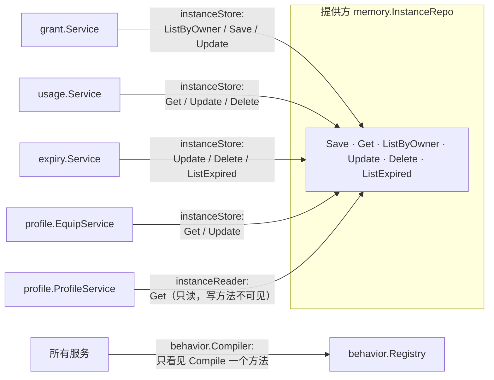
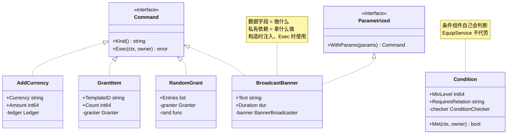
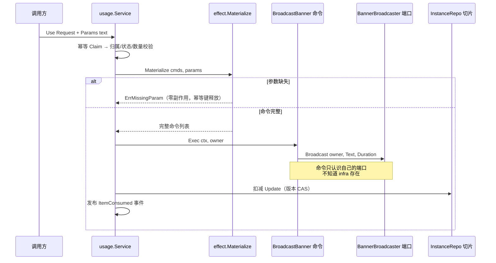
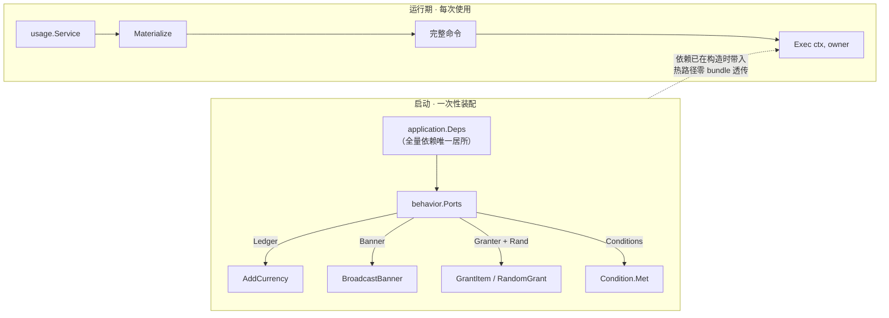

# 道具子系统设计演进

本文记录道具子系统从初始设计到 v1.0 的完整演进过程，重点不是"最终长什么样"，而是**每个设计决策为什么这样定、走过哪些弯路、被什么原则纠正**。

## 1. 最终架构

```
interfaces（未来：gRPC/GM 命令）
    │
application ──────────── 装配点（唯一允许出现"全量依赖"的地方）
    │                       behavior.Ports / application.Deps 在这里分发依赖
    ▼
domain（纯领域，零基础设施依赖）
    │
    ├── model        模板/实例/槽位/修饰符 —— 纯数据
    ├── behavior     行为组件 + Registry（配置→组件）+ Compiler（窄接口）
    ├── effect       效果命令（自带依赖、自带物化规则、自带 Exec）
    ├── grant        发放（堆叠/时效/幂等）      ── 消费侧窄接口
    ├── usage        主动使用（物化→执行→扣减）
    ├── profile      穿戴 + 展示快照 + 场景排序
    ├── expiry       过期策略（remove/unequip/downgrade）
    ├── relation     双主体关系（独立聚合根）
    └── event        领域事件
    │
infrastructure ──────── memory（完整仓储实现，供测试与 MySQL 实现对照）
    │
catalog ─────────────── 9 类道具模板示例集（纯配置数据）
```

## 2. 接口依赖关系图（解耦视角）

### 图 0 · 分层依赖与依赖倒置

实线 = 编译期依赖（全部指向 domain 内声明的抽象）；虚线 = 运行期实现绑定（只在装配点发生）。
关键：**domain 没有任何箭头指向 infrastructure**——不是自觉，是编译器禁止（domain 不 import infra）。



### 图 1 · 消费侧窄接口：同一个仓储，每个服务只看见自己的切片

提供方实现 6 个方法；每个消费者在**自己包里**声明未导出窄接口，用到几个声明几个。想调用切片外的方法，编译不过——解耦由类型系统强制，不靠 review 纪律。



### 图 2 · 效果命令：数据与依赖各归其主

接口只有两个方法且永不增长；每个命令私有持有**自己那一个**端口，新增效果 = 新增 struct，零中央修改。



### 图 3 · 使用时序：接缝两侧的不变量

用户输入止步于物化缝；执行缝只接收"已完整"的命令；命令只调自己的端口。缺参数在任何副作用发生前失败。



### 图 4 · 装配点与热路径分离：bundle 的唯一居所

全量依赖（Ports）只在启动时存在一次，把端口分发给各组件的构造函数；之后热路径上每次调用只携带 `(ctx, owner)`——不存在任何"工具箱"穿越接缝。



## 3. 演进阶段

### 阶段一：初始内核（`401396f`）

设计支柱：

| 支柱 | 内容 |
|---|---|
| 模板/实例分离 | 规则在模板（只读配置），状态在实例（运行时数据） |
| 组合优于继承 | 道具 = 分类标签 + 行为组件集合（Stackable/Expirable/Equippable/Usable/Bindable/Passive），新增类型不加继承层级 |
| 使用与效果解耦 | 使用不直接写业务，产出效果命令交结算管道 |
| 端口模式 | 账本、仓储、幂等全部接口注入 |
| 场景排序 | 多级排序键 + 每场景一个 SortPolicy |

### 阶段二：九个道具的检验（`a59e419`…`4386f14`）

座驾、勋章、头饰、VIP、关系卡、飘屏、聊天气泡、铭牌、CP 戒指逐个落地。

**组合内核经受住了考验**：九类道具无一改写核心，全部表达为"行为组件组合 + 槽位 + 场景策略"。

**暴露三个未预测到的缺口**：

1. 双主体关系（关系卡/CP 戒指是"两个玩家之间的契约"）→ 新增 `domain/relation` 独立聚合 + `Condition.requires_relation` 穿戴前置 + 解除联动卸下
2. 使用时动态参数（飘屏文案）→ 引发下述接口演进
3. 降级语义欠定义（降级后时效归谁）→ `01c067f` 修复：降级目标继承自身模板时效，支持 vip3→vip1→vip0 链

### 阶段三：接口演进四步曲（本系统最重要的一课）

飘屏需要"使用时由用户输入文案"，原 `Executor.Execute(ctx, owner, cmds)` 接口被迫变更。此后经历四次修正：

**第一步：接口加 params（`234aaca`）——签名漂移**

```go
Execute(ctx, owner, params map[string]any, cmds []Command) error
```

问题：需求演进 → 加参数 → 签名变更 → 所有实现方/调用方连锁修改。接口跟着实现走，未来还会再改。

**第二步：struct 参数 / 大而全 Runtime（曾讨论，被否决）**

用 `ExecuteInput` 结构体或 `Runtime` 工具箱承载演进。问题：不加纪律会进化成垃圾场（每个命令被迫看见全世界的工具），而"靠纪律执行"不可接受——违反**字段必须与场景强关联**。

**第三步：命令物化（`d459a91`）——"东西没装完，别出厂"**

用户输入的归属位置在"使用"阶段，不在"执行"阶段：

```
usage.Request.Params
    │
    ▼
effect.Materialize(cmds, params)   ← 唯一知道用户输入的地方
    │  静态命令原样通过；动态命令绑定载荷
    ▼
完整命令 ──→ Executor.Execute(ctx, owner, cmds)   ← 接缝只依赖"命令已完整"这一不变量
```

场景字段强关联在命令自身：`BroadcastBanner.Text` 是广播场景的载荷，改名卡的新名字是 `Rename.NewName`。执行器永远不知道 params 存在。

**第四步：每对象自持依赖 + 窄接口（`093d8e8`、`ef12b54`、`6900000`）**

中央 type-switch 执行器和 Runtime 工具箱全部删除：

```go
type BroadcastBanner struct {
    Text     string                        // 数据：做什么
    Duration time.Duration
    banner   BannerBroadcaster             // 私有依赖：拿什么做（构造时注入）
}
func (c BroadcastBanner) Exec(ctx context.Context, owner string) error
```

依赖分发只发生在**启动装配点**（`behavior.Ports` 只在 `NewRegistry` 存在一次，从不进入任何一次调用）；`Condition.Met(ctx, owner)` 让条件组件自己判断（不再由 EquipService 代劳）；所有领域服务改用**消费侧窄接口**（grant 只见 `ListByOwner/Save/Update`，profile 快照连写方法都看不见）。

## 4. 设计原则与代码对照

| 原则 | 落点 |
|---|---|
| 组合优于继承 | `catalog` 九类道具 = 行为组件组合，核心零改动 |
| 变化落在数据上，不落在接缝形状上 | 新道具=新 Command 类型/新 Behavior；`Execute`/`Compile`/`Exec` 签名自确立后未再变更 |
| 命令出厂即完整 | `effect.Materialize` 物化后才允许执行；缺参数在任何副作用前报错 |
| 字段与场景强关联 | `BroadcastBanner.banner`、`Condition.checker` 各归其主 |
| 每个对象只看见自己需要的 | 消费侧窄接口（domain/grant/grant.go 等）；`behavior.Compiler` 取代裸 Registry |
| bundle 只活在装配点 | `application.Deps`、`behavior.Ports` 仅启动期存在 |
| 不靠纪律，靠类型系统 | 未导出接口 + 包结构 + 编译器强制；越界调用无法编译 |
| 端口模式（依赖倒置） | Ledger/BannerBroadcaster/Granter/ConditionChecker 由领域声明，infra 实现 |
| 领域纯度 | domain 不 import application/infrastructure/catalog（生产代码） |

## 5. 代价复盘

| 事项 | commits | 备注 |
|---|---|---|
| 初始内核 | 1 | |
| 9 类道具 | 10 | 含 1 个失败测试混入后的修复 |
| 接口演进 | 4 | 其中 2 次是被否决方案的清理 |
| review 修复 | 1 | 错误类型误用、App 持裸 Registry |

教训：初始设计预测了约八成演进；预测不了的（双主体关系、动态参数），因为组合内核的存在，每次修正的代价是"新增模块"而非"重写核心"。**模块化设计的价值不是未卜先知，而是让每次'没想到'只值一个新文件。**

## 6. 已知边界与后续方向

- 存储仅有内存实现；MySQL（模板表/实例表/条件更新）与 Redis（背包缓存/过期 ZSet 调度）按 `repository` 提供方接口接入
- 对方同意流程（关系建立）、VIP 每日定时特权、座驾进阶养成线未纳入 v1
- `relation.Repo` 供方接口较宽，接入真实存储时可按消费侧继续收窄
